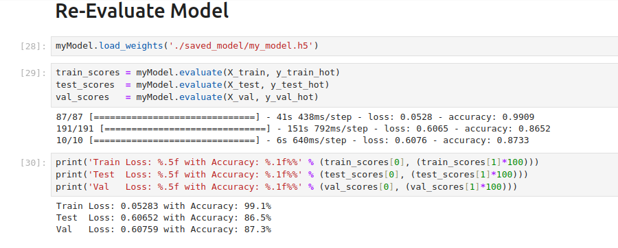

# **Caltech101 Dataset Image Classification**

This project involves the classification of images from the **Caltech101** dataset using TensorFlow. The dataset contains 102 object categories, and the goal is to classify images into one of these 102 classes. The model is trained using Keras and TensorFlow, with multiple formats for saving the trained model, including `.h5`, **Keras**, **SavedModel**, **TensorFlow.js (TFJS)**, and **TensorFlow Lite (TFLite)**.

### **Model Architecture and Training**
The model was trained on the **Caltech101** dataset, which consists of 102 categories of images. The system achieved excellent performance during training and evaluation:

- **Training Results**:
  - **Loss**: 0.06780
  - **Accuracy**: 98.1%

- **Testing Results**:
  - **Loss**: 0.91814
  - **Accuracy**: 79.4%

- **Validation Results**:
  - **Loss**: 0.96827
  - **Accuracy**: 77.0%

The model uses a Convolutional Neural Network (CNN) architecture built using Keras layers, and the dataset is preprocessed using image resizing and normalization.

### **Model Saving Formats**

The trained model can be saved and used in different formats for easy deployment:

1. **.h5** (Keras Model)
   - The model is saved as a `.h5` file, which is compatible with Keras for future training and inference.
   
2. **TensorFlow SavedModel**
   - The model is saved in the TensorFlow **SavedModel** format, which is the default TensorFlow format for saving models and can be used for inference or further training.

3. **TensorFlow.js (TFJS)**
   - The trained model is also converted into the **TensorFlow.js (TFJS)** format, allowing you to run predictions in the browser or in Node.js.

4. **TensorFlow Lite (TFLite)**
   - The model is converted to the **TensorFlow Lite** format, optimized for running on mobile and embedded devices with efficient resource usage.

### **Project Structure**

```
project/
│
├── tfjs_model/
│   ├── group1-shard1of1.bin      # TensorFlow.js model shard
│   └── model.json                # TensorFlow.js model definition
│
├── tflite/
│   ├── model.tflite              # TensorFlow Lite model
│   └── label.txt                 # Labels for the TFLite model
│
├── saved_model/
│   ├── saved_model.pb            # TensorFlow SavedModel protobuf
│   └── variables                 # Saved model variables
│
├── h5_saved_model/
│   ├── my_model.h5               # Keras model in .h5 format
│   └── my_model.keras            # Keras model in .keras format
│
├── Saved _TfLite_and_TensorflowJS_Model.ipynb # Jupyter notebook for converting to TF Lite and TFJS
├── notebook.ipynb                # Jupyter notebook with the model implementation
├── README.md                     # Project description
└── requirements.txt              # Dependencies file
```

### **Results**
After training, the model achieved the following performance on the **Caltech101** dataset:

- **Training Accuracy**: 98.1%
- **Testing Accuracy**: 79.4%
- **Validation Accuracy**: 77.0%

This high training accuracy suggests that the model generalizes well to the training data, while the testing and validation results indicate that the model still performs well on unseen data.

### **Contributions**
Feel free to contribute to the project by improving the model architecture, adding more data augmentation techniques, or optimizing the inference speed for deployment.

### **License**
This project is licensed under the MIT License.
